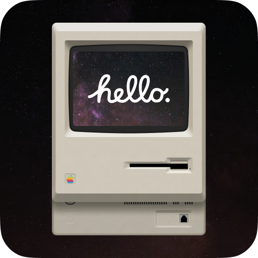

# MacOS Molten Patcher



A Kitten Space Agency mod that lets the Windows version of the game run on macOS through Wine
(e.g. in a Sikarugir wrapper). A StarMap hook runs it before the game starts; it applies the
patches in its `patches/` folder to the wrapper and the game files.

Each patch is a plain text file that says what it changes and why.

## Install

Requires [StarMap](https://github.com/StarMapLoader/StarMap). The wrapper's engine must be Wine 10 (tested on WS12WineSikarugir10.0_6); Wine 11 is not supported.

1. Download `MacOSMoltenPatcher.zip` from the latest release, or build it (see [Build](#build)).
2. Extract the `MacOSMoltenPatcher` folder into KSA's mods folder
   (`Documents/My Games/Kitten Space Agency/mods/`).
3. Start the game through StarMap.

## Build

Needs macOS with Xcode, Python 3.11 and the .NET 10 SDK. From the repo folder:

```sh
./build.sh
dotnet build -c Release -o out/MacOSMoltenPatcher
```


## Warning: changes are permanent

The patches edit files in your wrapper and game folder. **Removing the mod does not undo them.**
Before changing a file, the mod saves the original next to it as `<file>.orig`. To revert, copy
the `.orig` back over the file.

## Licenses

Mod code: MIT. Bundled third-party files come with their licenses in the `licenses/` folder.
